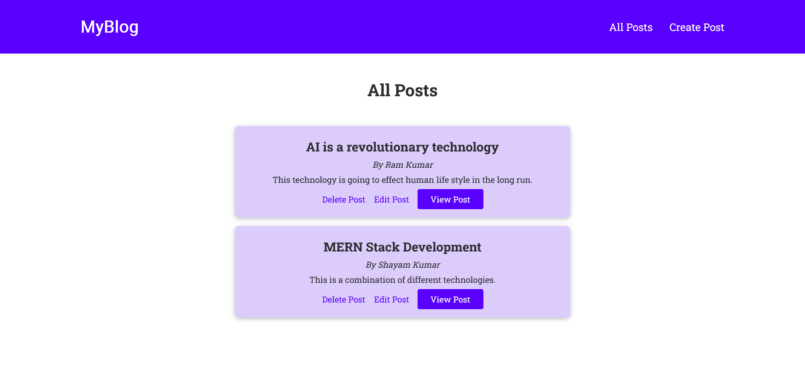

# Blog Website

## Screenshot

## Tech Stack
- HTML
- CSS
- JavaScript
- Express.js
- MySQL
- EJS
- Git

## Features
This website allows individuals to perform CRUD operations, and its key features include:
- Creating blog posts.
- Editing existing blog posts.
- Deleting posts.
- Accessing a comprehensive list of all posts in one place.

I've designed this blog app with a minimalist user interface to provide a great user experience. Additionally, I've implemented error handling.

**NOTE**: This application has not been deployed live yet but you can check out its video for an overview of the application on my linkedin posts.

You can reach out to me on linkedin, this is my [LinkedIn](https://www.linkedin.com/in/kapil-kharera-191b83245/) profile.

Please feel free to provide feedback on my work.